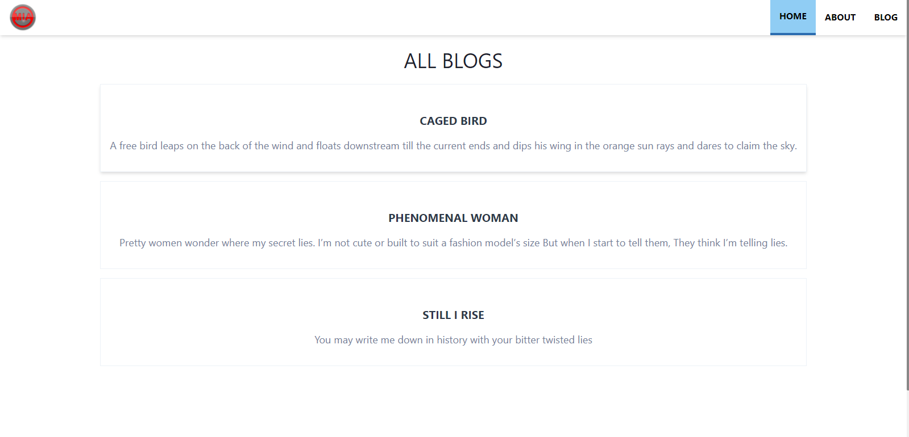
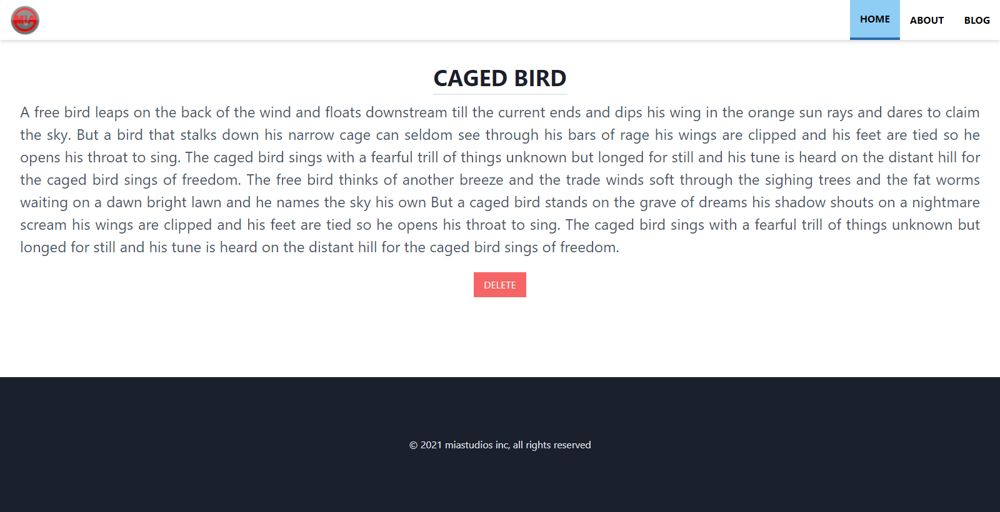
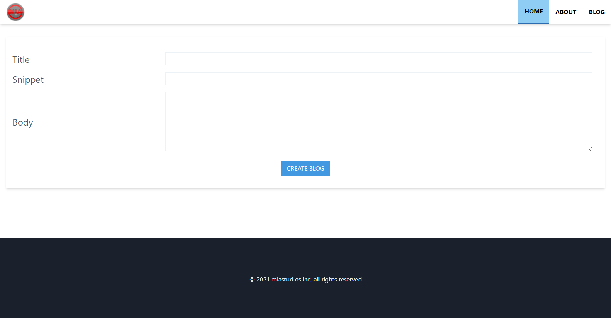

# node_express_ejs_blog

this  is a simple blog with node js, express, ejs view engine and mongo db as the database

## preview

## This is not a design based repo, just focuses on functionality and concepts of express and node js

## how to use this repo

- make sure `node js` installed on your system
- clone the repo or download the zip and extract
- open a terminal in the extracted directory or the clone directory
- run `npm install` or `yarn install` to install the devDependencies
- rename .env.example to .env
- replace the `PORT` value in .env file
- replace the `DBURL` value in .env file
- run `npm start` or `yarn start` to run the server
- alternatively run `npm dev` or `yarn dev` to use nodemon to run the server

## technologies

- [tailwind css](<https://tailwindcss.com/>)
- [node js](<https://nodejs.org/en/>)
- [ejs](<https://ejs.co/>)
- [express js](<https://expressjs.com/>)
- [mongodb](<https://www.mongodb.com/>)
- [mongoose](<https://mongoosejs.com/>)
- [nodemon](<https://www.npmjs.com/package/nodemon/>)
- [morgan](<https://www.npmjs.com/package/morgan/>)
- [dotenv](<https://www.npmjs.com/package/dotenv/>)
